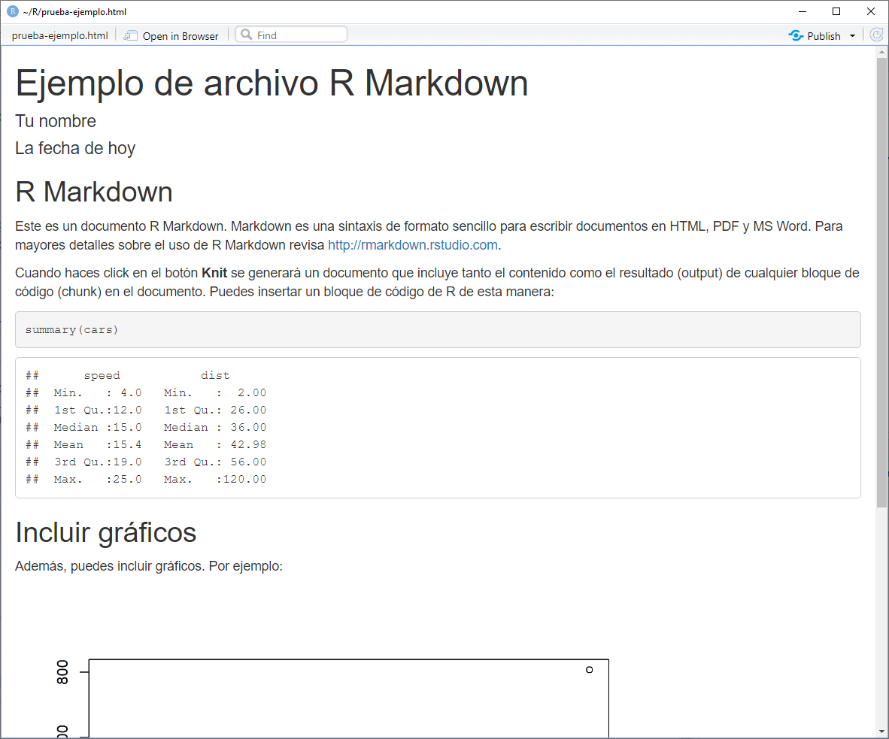

```{r setup, include=FALSE}
knitr::opts_chunk$set(echo = FALSE)
```

## Objetivos

Verificar que los participantes cuenten con el software adecuado para el inicio de las sesiones

1. Instalación de R 
2. Instalación de R Studio
3. Instalación de paquetes
4. Creación de cuenta Rpubs.com
5. Prueba de Knit
6. Subir el contenido a Rpubs.com

## Instalación de R

Instalar desde *The Comprehensive R Archive Network* - **CRAN**.

- Opción 1: Googlear "Descargar R"
- Opción 2: Ir directamente al  [CRAN](https://cran.r-project.org/)

Elegir la versión (mínimo 4.1) adecuada para el sistema operativo a utilizar y elegir todas las opciones por defecto una vez iniciado el instalador, es decir, no cambiar ninguna opción.

Si ya tuvieras una versión de R previa en la que trabajas cotidianamente, házmelo saber para guiarte en la actualización de paquetes.

## Instalación de R Studio

Instalar R Studio Desktop desde la web de [RStudio](https://www.rstudio.com/products/rstudio/)

Elegir la versión (mínimo v 1.4) adecuada para el sistema operativo a utilizar y elegir todas las opciones por defecto una vez iniciado el instalador, es decir, no cambiar ninguna opción.

## Instalación de paquetes

En la consola de R dentro de RStudio, utilizar el siguiente código línea por línea:

```{r, echo=TRUE, eval=FALSE}
install.packages(c("tidyverse", "rmarkdown", "rsconnect", "remotes"))
remotes::install_github("calderonsamuel/templatesRmd")
```

## Cuenta en Rpubs.com

Rpubs.com es una plataforma en la que puedes subir gratuitamente trabajos realizados con R Markdown desde RStudio. Es usado por muchas instituciones en sus cursos de Estadística, Machine Learning, Ciencia de Datos, etc.

1. En un navegador, dirígete a <https://rpubs.com/>.
2. Haz click en "Register" para crear una cuenta nueva. 
3. Llena el formulario de registro. Recomiendo usar un username *sobrio/profesional*.

Para usar la plataforma en el futuro bastará con ingresar (Sign in).

## Prueba de Knit

Crear un documento R Markdown dentro de RStudio. 

- Debes ir File > New file > R Markdown
- Selecciona "From template" y elige "Plantilla ejemplo" del paquete `templatesRmd`.
- Cambia los parámetros `author` y `date` en el encabezado del documento.

Renderiza el documento con el botón **Knit**.

---

{width=80%}

## Subir el contenido a Rpubs.com

En el documento renderizado, ubica el botón "Publish" en la esquina superior derecha. Elige la opción Rpubs.com y llena los detalles solicitados por el navegador.

Listo! Ya tienes todo lo necesario para el taller.

