```{r setup, include=FALSE}
knitr::opts_chunk$set(echo = TRUE)
```

# Presentación del curso

## Docente

Samuel Enrique Calderon Serrano:

-   Politólogo de la Universidad Antonio Ruiz de Montoya.

-   Actualmente trabaja en la Superintendencia Nacional de Educación Universitaria - SUNEDU como miembro del Equipo Técnico Normativo de la Dirección de Licenciamiento.

-   Miembro de la organización [DecideBien](https://github.com/DecideBienpe). Colabora ocasionalmente en iniciativas de código abierto.

-   Proviene de Lima, Perú.

-   Otros canales:

    -   Web: [www.samuelenrique.com](https://www.samuelenrique.com)
    -   Twitter: [\@samuel\_\_case](https://twitter.com/samuel__case)
    -   Github: [/calderonsamuel](https://github.com/calderonsamuel)

## Contenido del curso

-   Público objetivo:

    -   Estudiantes o egresados de carreras de ciencias sociales, periodismo o educación con interés en aprender herramientas de análisis y visualización de datos.

-   Aprendizajes esperados:

    -   Elementos básicos del análisis de datos usando R a través de RStudio

        -   Importación de datos
        -   Limpieza y ordenamiento de datos
        -   Análisis exploratorio de datos ordenados (tidy data)

    -   Elaboración de reportes de análisis de datos usando R Markdown

------------------------------------------------------------------------

Este curso NO enseñará:

-   Estadística
-   Programación
-   Excel, SPSS, Stata, etc

## Producto final esperado

Cada participante elaborará un reporte que incluirá:

-   Descripción de los conjuntos de datos utilizados
-   Explicación de metodología utilizada
-   Productos de análisis (ránkings, tablas de frecuencia, gráficos, etc)
-   Interpretación de resultados

El reporte usará conjuntos de datos abiertos y será publicado vía web en formato *bookdown*.

Ejemplo: <https://bit.ly/TallerDatos-02>

## Software requerido

Para la presente edición del taller es necesario contar con el siguiente software instalado:

1.  R programming language (versión 4.0.0 o superior)
2.  RStudio IDE (versión 1.4.0 o superior)

También se necesitan los siguientes paquetes de R:

1.  tidyverse (colección de paquetes)
2.  rmarkdown

## Mapa de la sesión 1

Trabajaremos tres (3) temas en esta sesión:

1.  Presentación de R y RStudio
2.  Presentación de R Markdown
3.  Repaso de conceptos estadísticos

## Inscripción a Rpubs.com

Adicionalmente, se requiere que los participantes cuenten con una cuenta en el servicio Rpubs para poder subir a la web los trabajos realizados.

La inscripción es sumamente sencilla y rápida

------------------------------------------------------------------------

¿Qué es Rpubs.com?

------------------------------------------------------------------------

1.  Dirigirse a <https://rpubs.com>

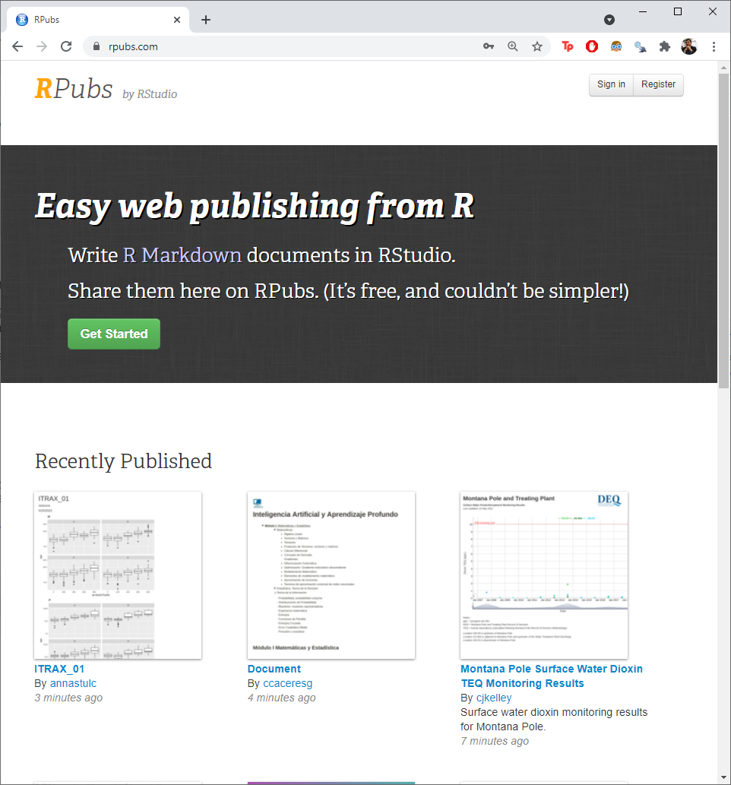{width="80%"}

------------------------------------------------------------------------

2.  Seleccionar "Register"

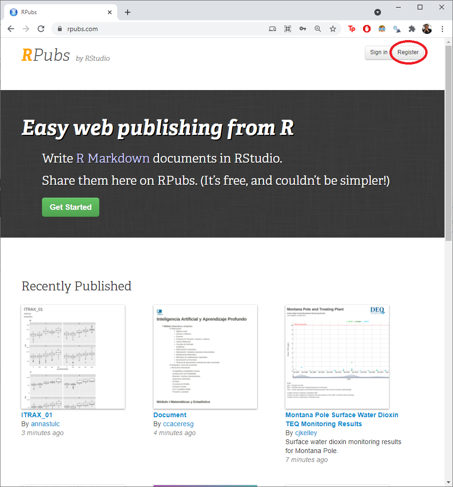{width="80%"}

------------------------------------------------------------------------

3.  Ingresar los datos solicitados.

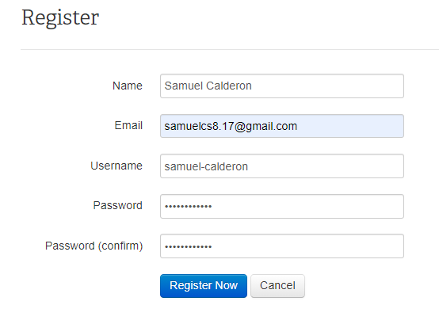{width="80%"}

------------------------------------------------------------------------

Con esto es suficiente.

En el futuro, puedes acceder con tu nombre de usuario (o email) y contraseña.

Por seguridad, puedes guardar esos datos en un gestor de contraseñas, como el de Google.

# R a través de los años

## R en la terminal

R es un lenguaje de programación. Como todo lo que ocurre en una computadora, puede ejecutarse en una ventana de terminal. En Windows la conocemos como la ventana de comandos.

------------------------------------------------------------------------

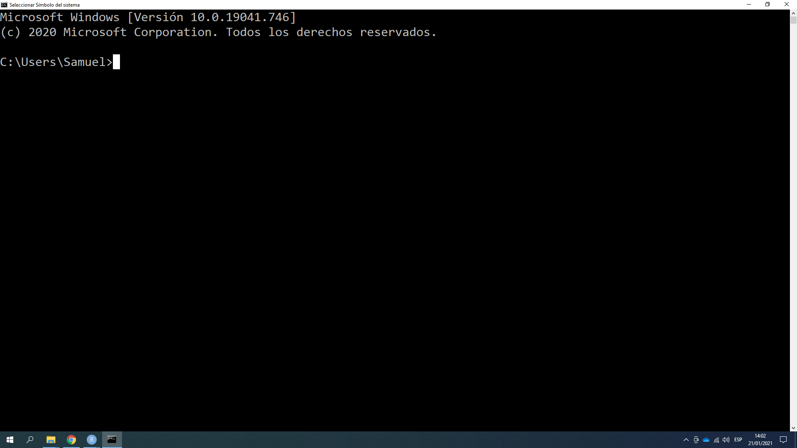{width="100%"}

------------------------------------------------------------------------

Es posible acceder a la consola de R desde una terminal.

-   Windows: escribir la ubicación del ejecutable de R
-   Mac o Linux: escribir `R`

------------------------------------------------------------------------

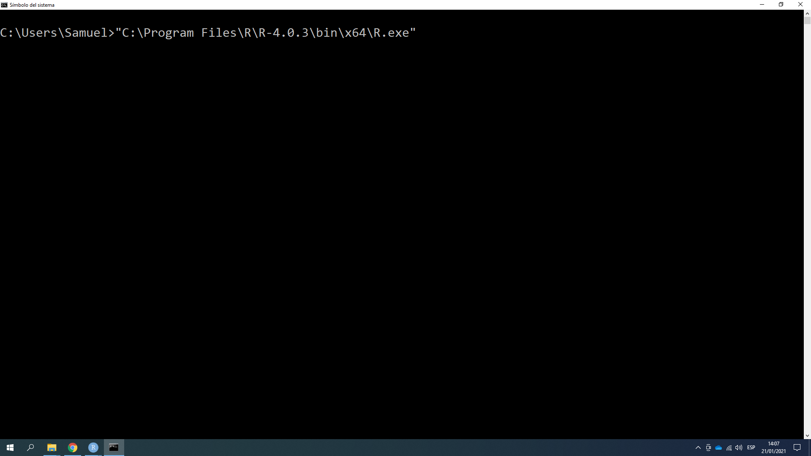{width="100%"}

------------------------------------------------------------------------

{width="100%"}

## El Rgui como editor

En los años 2000, se elaboró una interfaz más amigable y dedicada a trabajar con R llamada "R Graphic User Interface" (Rgui).

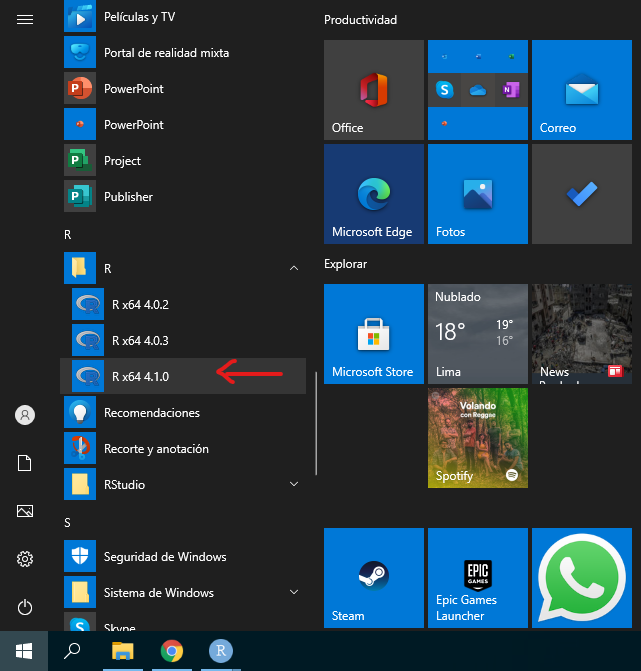{width="50%"}

------------------------------------------------------------------------

Esta interfaz nos conecta directamente a la consola y nos brinda la opción de tener un editor de scripts, previsualizar nuestros gráficos, entre otras cosas.

{width="100%"}

## RStudio

En la década de los 2010 aparece el proyecto RStudio, gracias al trabajo de J.J. Allaire.

{width="100%"}

------------------------------------------------------------------------

Su desarrollo inició en diciembre de 2010 y su primera versión oficial se lanzó en noviembre de 2016. Es el editor con el que trabajaremos en estas sesiones.

{width="100%"}

# El editor de código RStudio

------------------------------------------------------------------------

Generalmente, no será necesario acceder a R a través de una terminal ni del Rgui, porque lo haremos utilizando el entorno de programación RStudio, que nos brinda una consola de R automáticamente.

Rstudio nos brinda varios paneles que cumplen distintas funciones. Es importante mencionar que el siguiente listado toma en cuenta la ubicación por defecto de los paneles, ya que se pueden modificar según el gusto de cada usuario.

## El panel de edición

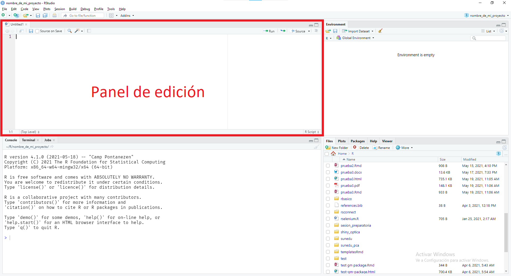{width="100%"}

------------------------------------------------------------------------

En este panel aparecerán todos los archivos editables. RStudio nos brinda la opción de utilizar múltiples tipos de archivo y de tener varios abiertos al mismo tiempo.

Entre los formatos que se pueden abrir y editar en este panel encontramos:

-   *.R*: Scripts de R
-   *.Rmd*: Archivos R Markdown
-   *.py*: Scripts de Python
-   *.html*: Documentos en formato HTML
-   *.css*: Hojas de estilo de cascada
-   *.txt*: Documentos de texto sin enriquecer
-   *.csv*: Archivos de valores separados por comas
-   etc

------------------------------------------------------------------------

En el panel de edición también podremos obtener un visor de datos cada vez que lo solicitemos.

## El panel de consola

{width="100%"}

------------------------------------------------------------------------

En el panel de consola encontramos directamente la consola de R lista para ser usada.

Generalmente, este panel es usado directamente en ocasionas muy puntuales, ya que la mayor parte del tiempo se trabajará con código en el panel de edición.

Cabe mencionar que este panel también brinda acceso a una pestaña de Terminal y a una pestaña de ejecución de trabajos en paralelo (Jobs).

## El panel de environment

{width="100%"}

------------------------------------------------------------------------

Desde este panel tenemos acceso a todos los environment de nuestra sesión de R. Cuando creemos un objeto, nos aparecerá listado en este panel.

Cuando trabajemos en otros tipos de proyectos, como la creación de paquetes, conexión remota a bases de datos, creación de páginas web, uso de sistemas de control de versiones, etc, este panel tendrá otras pestañas para mostrar el estado de esos trabajos.

## El panel de apoyo

{width="100%"}

------------------------------------------------------------------------

Este panel nos permitirá previsualizar el resultado de nuestro trabajo. Cuenta con lo siguiente:

-   Explorador de archivos (Files)
-   Ventana de gráficos (Plots)
-   Explorador de paquetes instalados (Packages)
-   Ventana de ayuda (Help)
-   Visualizador de contenido Web (View)

# El directorio de trabajo

------------------------------------------------------------------------

El directorio de trabajo es donde R busca los archivos que le pides cargar, y donde pondrá los archivos que le pidas guardar. RStudio muestra el directorio de trabajo en la parte superior de la consola.

En muchas ocasiones existe la tentación de trabajar con archivos que están fuera de nuestro directorio de trabajo. Es recomendable evitar este comportamiento porque suele ser la raíz de muchos problemas.

Para ello, RStudio cuenta con los *Proyectos*, una manera sencilla de organizar nuestro trabajo. Mi mayor recomendación para usuarios de RStudio iniciantes y especialistas es trabajar ***siempre*** con proyectos dentro de RStudio.

## Asignar directorio de trabajo por defecto

El directorio de trabajo por defecto es la carpeta en la que R usará cada vez que no estemos dentro de un proyecto. Por defecto, es la carpeta de "Documentos" del usuario de la computadora.

RStudio cuenta con un explorador de archivos para revisar el contenido de nuestros directorios.

------------------------------------------------------------------------

{width="100%"}

------------------------------------------------------------------------

Mi recomendación personal es utilizar como directorio general la carpeta llamada "R" dentro de "Documentos".

1.  Acceder a "Global options" dentro del Menú "Tools".
2.  En las opciones generales, elegir la carpeta "R" como *Default working directory*.

------------------------------------------------------------------------

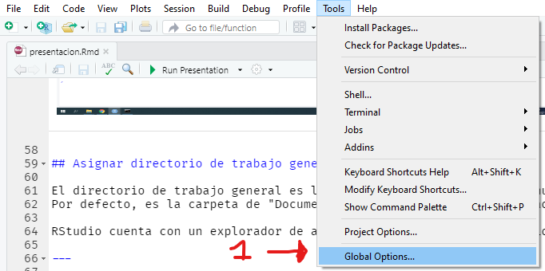{width="100%"}

------------------------------------------------------------------------

{height="100%"}

# Proyectos

## Crear proyectos

Puedes crear un proyecto siguiendo la siguiente ruta:

1.  Ir al menú "File"
2.  Hacer click en "New Project"
3.  Elegir "New directory"
4.  Elegir "New project" (las demás opciones son plantillas para proyectos típicos con los que te podrás familiarizar más adelante)
5.  Indicar el nombre del proyecto
6.  Elegir la carpeta en la que se guardará el proyecto. (Recomiendo que sea la carpeta "R")
7.  Hacer click en "Create project"

Si estás usando el servicio <https://www.rstudio.cloud> puedes crear nuevos proyectos en tu espacio de trabajo (Your workspace).

------------------------------------------------------------------------

1.  Ir al menú file

{width="100%"}

------------------------------------------------------------------------

<ol start=2>

<li>

Hacer click en "New Project"

</li>

{width="100%"}

------------------------------------------------------------------------

<ol start=3>

<li>

Elegir "New directory"

</li>

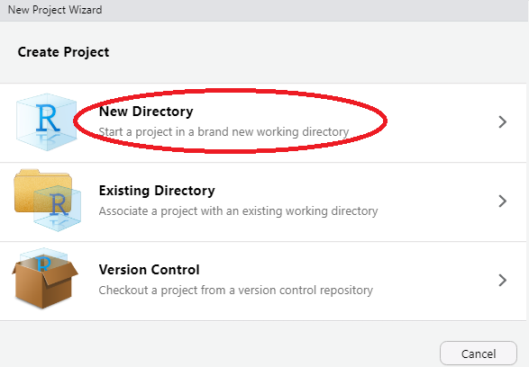

------------------------------------------------------------------------

<ol start=4>

<li>

Elegir "New project"

</li>

Las demás opciones son plantillas para proyectos típicos con los que te podrás familiarizar más adelante


------------------------------------------------------------------------

<ol start=5>

<li>

Indicar el nombre del proyecto

</li>

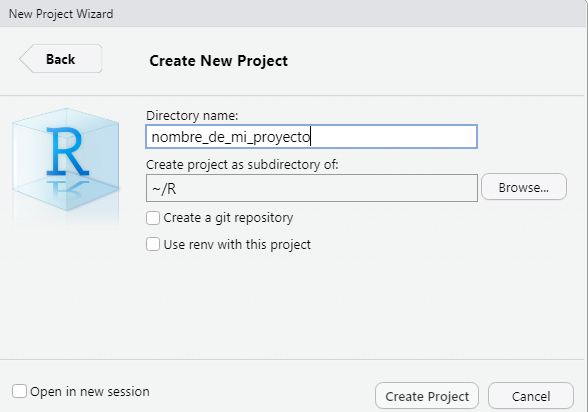

------------------------------------------------------------------------

<ol start=6>

<li>

Elegir la carpeta en la que se guardará el proyecto

</li>

Recomiendo que sea la carpeta "R"

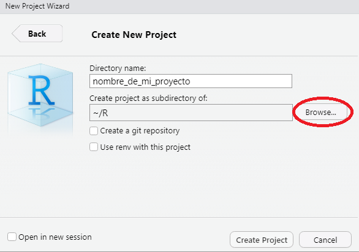

------------------------------------------------------------------------


------------------------------------------------------------------------

<ol start=7>

<li>

Hacer click en "Create project"

</li>

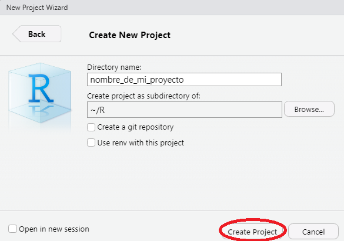

------------------------------------------------------------------------

RStudio te dará varias señales de que creaste exitosamente tu proyecto. También, te indicará cuál es el directorio de trabajo de tu proyecto.

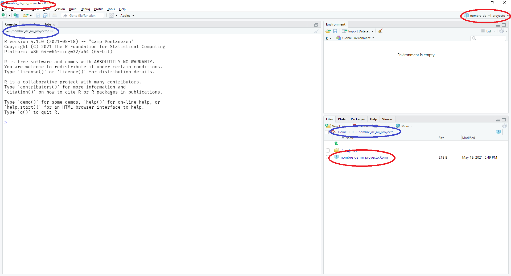{width="100%"}

## Usar un proyecto

Al crear un nuevo proyecto, RStudio crea para ti una carpeta con un archivo que lleva un nombre tipo *"\*.Rproj"*.

{width="100%"}

------------------------------------------------------------------------

Cuando estés fuera del proyecto bastará con hacer doble click en ese archivo para que RStudio abra una sesión de trabajo usando la ubicación del proyecto.

{width="100%"}

------------------------------------------------------------------------

{width="100%"}

------------------------------------------------------------------------

Si deseas cerrar el proyecto actual para trabajar en otro, puedes hacerlo desde el menú "File" haciendo click en "Close Project".

{width="45%"}

# Trabajo 1: Crea tu primer proyecto

## Instrucciones

1.  Crea un nuevo proyecto llamado: 01-ejercicios
2.  Una vez creado el proyecto, en la consola ejecuta el siguiente código:

```{r, eval=FALSE}
getwd()
```

3.  Copia y pega el resultado de ese código en el chat de la llamada grupal.

# Descanso de 5 minutos

# Elementos básicos de Rmarkdown

## ¿Qué es?

R Markdown nos provee de un marco de trabajo unificado para la ciencia de datos y el análisis de datos, combinando código, sus resultados, y los comentarios escritos por el autor. Los documentos R Markdown son totalmente reproducibles y soportan docenas de formatos de salida como PDFs, archivos Word, diapositivas, y más.

Uno de los objetivos de este taller es que los participantes aprendan a usar R Markdown y puedan encontrar la forma en que puede ayudarles a potenciar su trabajo.

Esta sección hace uso de la traducción al español del [capítulo R Markdown](https://r4ds-en-espaniol.netlify.app/r-markdown.html) de "R for Data Science".

------------------------------------------------------------------------

Los archivos R Markdown están diseñados para ser usados de tres maneras:

-   Para comunicarte con los tomadores de decisiones, que quieren enfocarse en las conclusiones, no en el código detrás del análisis
-   Para colaborar con otros analistas de datos (incluyendo a tu futuro yo), quienes están interesados tanto en tus conclusiones como en la manera en que llegaste a ellas (el código)
-   Como un entorno en el que realizar ciencia de datos, como un cuaderno de trabajo moderno en el que puedes capturar no sólo lo que hiciste sino también en lo que estabas pensando.

------------------------------------------------------------------------

**Instrucción:** Abrir el archivo "ejemplo01.Rmd" y guardarlo en el proyecto actual.

Típicamente, un archivo R Markdown contiene tres tipos de contenido importantes

-   Un encabezado YAML (opcional) rodeado por --- (tres guiones seguidos)
-   Bloques de código rodeados de \`\`\` (acentos graves)
-   Texto mezclado con formato simple como \# encabezados, *cursivas* o **negritas**

------------------------------------------------------------------------

Cuando abres un archivo .Rmd, se te muestra una interfaz de bloc de notas donde el código y sus resultados se intercalan. Puedes ejecutar cada bloque de código haciendo click en el botón "Run" (luce como un botón de *play* en la parte superior del bloque), o presionando Cmd/Ctrl + Shift + Enter. RStudio ejecuta el código y muestra los resultados seguidamente.

------------------------------------------------------------------------

Para producir un reporte completo conteniendo todo el texto, código y resultados, haz click en "Knit" o presiona Cmd/Ctrl + Shift + K. Esto mostrará el reporte en un panel de Vista previa, y creará un archivo HTML que puedes compartir con otras personas.

------------------------------------------------------------------------

Cuando haces knit el documento (knit significa tejer en inglés), R Markdown envía el .Rmd a knitr (<http://yihui.name/knitr/>) que ejecuta todos los bloques de código y crea un nuevo documento markdown (.md) que incluye el código y su output.

El archivo markdown generado por knitr es procesado entonces por pandoc (<http://pandoc.org/>) que es el responsable de crear el archivo terminado. La ventaja de este flujo de trabajo en dos pasos es que puedes crear un muy amplio rango de formatos de salida, que conocerás más adelante.

# Trabajo 2: Publica tu primer archivo en Rpubs.com

------------------------------------------------------------------------

Revisar si solicita packrat, rsconnect. En algunos casos solo publica desde microsoft edge. (revisar navegador por defecto)

Una vez renderizado el archivo en formato HTML, súbelo a la plataforma Rpubs.com

No olvides cambiar el nombre de autor en el YAML.

------------------------------------------------------------------------

{width="100%"}

------------------------------------------------------------------------

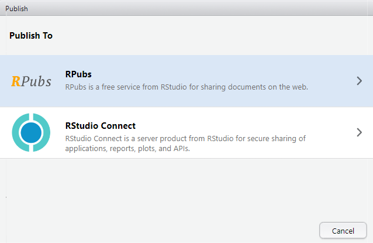{width="100%"}

------------------------------------------------------------------------

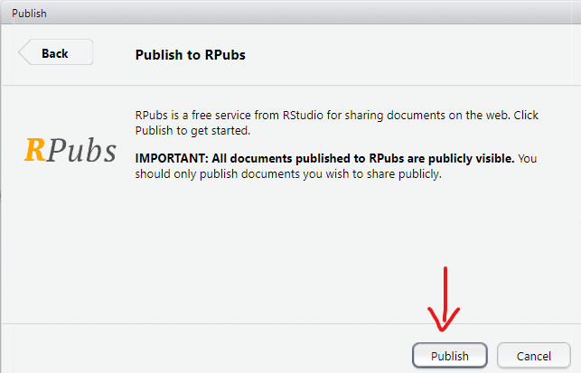{width="100%"}

------------------------------------------------------------------------

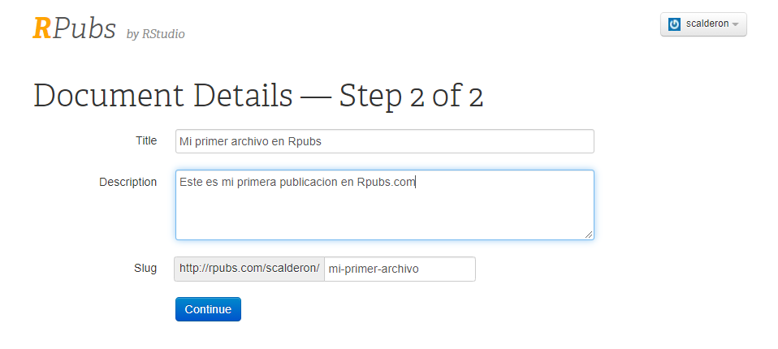{width="100%"}

------------------------------------------------------------------------

Una vez publicado, comparte el enlace de tu publicación en el chat de la llamada grupal.

# Trabajo 3: Crea tu propio archivo R Markdown

------------------------------------------------------------------------

Para comenzar con tu propio archivo .Rmd, selecciona File \> New File \> R Markdown... en la barra de menú. RStudio iniciará un asistente que puedes usar para pre-rellenar tu archivo con contenido útil que te recuerda cómo funcionan las principales características de R Markdown.

Todo el contenido después del YAML debe ser eliminado antes de continuar con el trabajo.

------------------------------------------------------------------------

El objetivo es poder replicar [este artículo](https://rpubs.com/talleresdedatos/articulo-01) acerca del coronavirus. Lo haremos usando la Guía de Referencia de R Markdown para saber cómo escribir.

**R Markdown: Reference Guide** ([descarga](https://rstudio.com/wp-content/uploads/2015/03/rmarkdown-reference.pdf))

Recuerda cambiar el nombre de autor antes de finalizar.

Deberá ser subido a Rpubs.com

------------------------------------------------------------------------

Alternativamente, puedes activar el editor visual de Markdown para trabajar con una interfaz similar a la de MS Word.

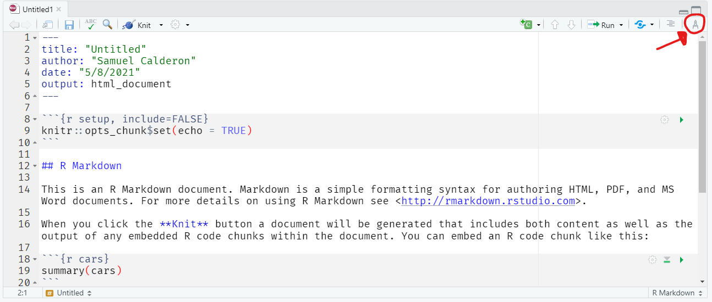{width="100%"}

------------------------------------------------------------------------

## {width="100%"}

Una vez publicado, comparte el enlace de tu publicación en el chat de la llamada grupal.

# Trabajo 4: Crea otro archivo R Markdown

## Instrucciones

Crea un nuevo archivo R Markdown. Selecciona File \> New File \> R Markdown... en la barra de menú. RStudio iniciará un asistente que puedes usar para pre-rellenar tu archivo con contenido útil que te recuerda cómo funcionan las principales características de R Markdown.

Todo el contenido después del YAML debe ser eliminado antes de continuar con el trabajo.

------------------------------------------------------------------------

El objetivo es poder replicar [este artículo](https://rpubs.com/talleresdedatos/articulo-02) acerca de Gladys Tejeda. Lo haremos usando la Guía de Referencia de R Markdown o el editor visual de Markdown dentro de RStudio.

------------------------------------------------------------------------

{width="100%"}

# Descanso de 5 minutos

# Repaso de conceptos estadísticos

## Mapa del repaso

Vamos a repasar los siguientes conceptos:

-   Promedio
-   Mediana
-   Moda
-   Ratio
-   Cuartiles
-   Percentiles
-   Rango
-   Rango intercuartil
-   Desviación Estándar

Generalmente, cuando hablamos de medidas de tendencia central, nos referimos a los tres primeros.

Estas definiciones vienen directamente o adaptadas de Wikipedia.

------------------------------------------------------------------------

Vamos a ver cómo se comportan estas medidas en dos conjuntos de datos:

```{r, echo=TRUE}
primer_conjunto <- c(14, 14, 20, 20, 31, 31, 31, 42, 43, 50, 97)
segundo_conjunto <- c(14, 14, 20, 20, 31, 31, 31, 42, 43, 50, 2000)
```

## Promedio

Es un solo número tomado como representante de una lista de números. A menudo, "promedio" se refiere a la media aritmética, la suma de los números dividida por cuántos números se promedian.

$$
promedio=\frac{X_1 + X_2 + ... + X_n}{n}
$$

------------------------------------------------------------------------

Si tuviéramos estos 5 números:

$$
11, 14, 16, 19, 20
$$

El promedio se calcularía:

$$
\frac{11 + 14+16+19+20}{5}
$$

------------------------------------------------------------------------

Si tuviéramos estos 7 números:

$$
100, 100, 100, 101, 153, 197, 2048
$$

El promedio se calcularía:

$$
\frac{100+100+100+101+153+197+2048}{7}
$$

------------------------------------------------------------------------

El promedio es la medida más usada cuando se trata de resumir datos.

-   Promedio de estatura

-   Precio promedio de un producto en el mercado

-   PBI per cápita (promedio del producto bruto interno de una población)

------------------------------------------------------------------------

Su principal ventaja es que tiene propiedades matemáticas que permiten hacer cálculos en base a su valor. Por ejemplo: varianza, desviación estándar, ponderaciones, etc.

Su principal desventaja es que es muy susceptible a valores extremos o poco comunes.

En R, usamos la función `mean()` para calcular el promedio de un listado de números.

------------------------------------------------------------------------

```{r, echo=TRUE}
mean(primer_conjunto)
mean(segundo_conjunto)
```

## Mediana

Un valor que representa la posición central en un listado de números ordenados. En otras palabras, me divide el conjunto de datos en dos mitades.

$$
10,11, 13, \color{red}{16}, 19, 21, 23
$$

Su principal ventaja es que no es susceptible a los valores extremos o atípicos.

$$
10, 11, 13, \color{red}{16}, 19, 21,2048
$$

------------------------------------------------------------------------

En R, usamos la función `median()` para calcular la mediana.

```{r, echo=TRUE}
primer_conjunto
segundo_conjunto
```

```{r, echo=TRUE}
median(primer_conjunto)
median(segundo_conjunto)
```

## Moda

La moda es el valor que aparece con mayor frecuencia en un conjunto de datos.

$$
\color{red}{11},
\color{red}{11}, 13, 15, 16
$$

Ten en cuenta que en ciertos conjuntos de datos, puede haber más de una moda.

$$
\color{red}{11}, \color{red}{11}, 13, 14, \color{green}{16}, \color{green}{16}, 18
$$

Su utilidad es mayor cuando queremos resumir variables cualitativas.

------------------------------------------------------------------------

A un grupo de 7 estudiantes se le preguntó: ¿Cuál es el material predominante en el piso de tu casa?

Respondieron:

-   Cemento

-   Loseta

-   Cemento

-   Parquet

-   Cemento

-   Loseta

-   Parquet

¿Cuál es la moda?

## Ejercicio

Dentro de tu grupo, discute cuál sería la mejor medida de tendencia central para responder las siguientes preguntas:

-   ¿Qué país ganó más medallas de oro en los juegos olímpicos?

-   ¿Cómo se desempeñó un grupo de estudiantes en un examen de Historia?

-   ¿Cuánto gastan los peruanos en comics mensualmente?

-   ¿Cuánto costó la gasolina en el distrito de Lince en enero de 2021?

## Ratio

La razón es una relación binaria entre magnitudes. En el caso de números toda razón se puede expresar como una fracción y eventualmente como un decimal.

En otras palabras, podemos usarla para expresar la relación entre dos mediciones.

------------------------------------------------------------------------

Por ejemplo:

$$
\frac{N\, de\, estudiantes}{N\, de\, docentes}
$$

Por ejemplo:

$$
\frac{m^2}{habitantes}
$$ Por ejemplo:

$$
\frac{ancho}{alto}
$$

------------------------------------------------------------------------

Para calcular un ratio en R, basta con aplicar una división:

```{r}
n_docentes <- 50
n_estudiantes <- 1050

ratio <- n_estudiantes/n_docentes

ratio
```

Quiere decir que por cada docente en la institución, hay 21 estudiantes.

## Cuartiles y percentiles

Del mismo modo que la mediana nos permite dividir el conjunto de datos en dos partes iguales, los cuartiles nos permiten dividir el conjunto de datos en cuatro partes iguales.

También existen los percentiles, que permiten dividir el conjunto de datos en 100 partes iguales.

------------------------------------------------------------------------

R proporciona la función `quantile()` para encontrar la posición deseada. Recuerda que el percentil 25 es equivalente al cuartil 1 (25%) y el percentil 75 es equivalente al cuartil 3 (75%).

```{r}
# Cuartil 1
quantile(primer_conjunto, 0.25)
# Cuartil 3
quantile(primer_conjunto, 0.75)
```

------------------------------------------------------------------------

También ten en cuenta que el percentil 50, el cuartil 2 y la mediana son el mismo valor.

```{r}
quantile(primer_conjunto, 0.5)
median(primer_conjunto)
```

## Rango

El Rango es el intervalo entre el valor máximo y el valor mínimo. Permite obtener una idea de la dispersión de los datos, cuanto mayor es el rango, aún más dispersos están los datos.

Por ejemplo, en el siguiente conjunto de datos:

$$
\color{red}{11}, 13, 15, 16, 18, 21, \color{green}{22} 
$$ El rango se calcula así:

$$
Rango = \color{green}{22} - \color{red}{11} = 9
$$

------------------------------------------------------------------------

En R, podemos obtenemos el intervalo con la función `range()` . Esto nos brinda el valor mínimo y máximo.

```{r, echo=TRUE}
range(primer_conjunto)
```

Podemos calcular el valor específico con una operación sencilla:

```{r, echo=TRUE}
max(primer_conjunto) - min(primer_conjunto)
```

Recuerda que el valor será sensible a los valores extremos.

```{r, echo=TRUE}
max(segundo_conjunto) - min(segundo_conjunto)
```

## Rango intercuartil

Es una medida de dispersión basada en los cuartiles. Resultado de la diferencia entre el tercer y primer cuartil.

$$
IQR = Q_3 - Q_1
$$

En R se puede calcular con la función `IQR()`:

```{r}
IQR(primer_conjunto)
quantile(primer_conjunto, 0.75) - quantile(primer_conjunto, 0.25)
```

## Desviación estándar

Es una medida que se utiliza para cuantificar la variación o la dispersión de un conjunto de datos numéricos.

Una desviación estándar baja indica que la mayor parte de los datos de una muestra tienden a estar agrupados cerca de su media, mientras que una desviación estándar alta indica que los datos se extienden sobre un rango de valores más amplio.

Será susceptible a los valores extremos.

------------------------------------------------------------------------

En R, podemos calcular la desviación estándar con la función `sd()`, por (*standard deviation*).

```{r, echo=TRUE}
sd(primer_conjunto)
sd(segundo_conjunto)
```

## Discusión

En tu grupo, discute cuál sería la medida que represente mejor estos conjuntos de datos. ¿Por qué?

1.  $1, 14, 15, 16, 20$
2.  $1, 2, 4, 6, 100$
3.  $Lima, Trujillo, Chiclayo, Lima, Arequipa, Cusco, Lima$
4.  $168, 169, 168, 169, 172, 181$

## Retroalimentación

Gracias por tu participación en la sesión de hoy. Para terminar, llena la encuesta de retroalimentación.

<https://bit.ly/Retro-Taller-I>
