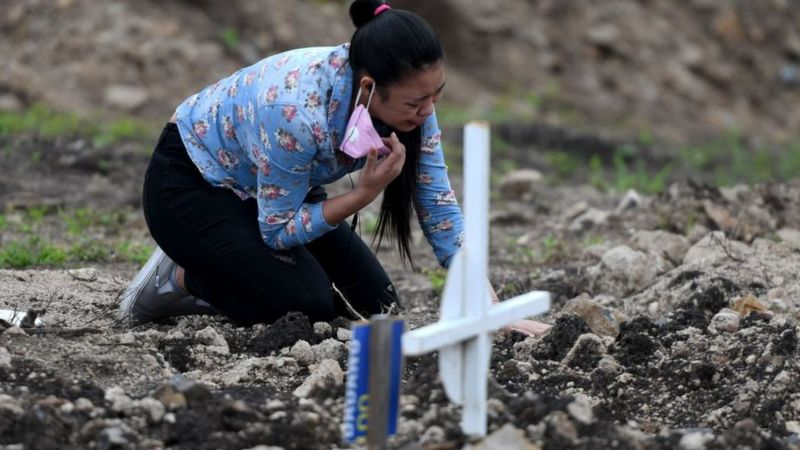

Este artículo es una versión recortada y adaptada de un artículo [publicado originalmente por la BBC](https://www.bbc.com/mundo/noticias-america-latina-56994622).

# Coronavirus: qué salió mal en América Latina para que se convirtiera en "la región más afectada del mundo" por la pandemia

Norberto Paredes @norbertparedes

BBC News Mundo

10 mayo 2021

**Mientras en Europa y Estados Unidos se vislumbra el fin de la pandemia, América Latina vive su peor momento y se ha convertido en uno de sus epicentros.**

Bogotá registra el mayor nivel de transmisión del covid-19 desde el inicio de la pandemia y sus autoridades emitieron una alerta roja, mientras que en Buenos Aires la ministra de Salud argentina confirmó la semana pasada que el sistema de salud está "en riesgo de desborde".

Al mismo tiempo, en Caracas ---donde los hospitales carecen de camas, insumos y hasta personal--- a muchos venezolanos sólo les queda rezarle al doctor José Gregorio Hernández, conocido como el "médico de los pobres", para que los cure.

Las capitales de **Colombia, Argentina y Venezuela** resumen una situación que se repite en la gran mayoría de las naciones latinoamericanas.

-   Durante la última semana de abril, la región acumuló alrededor del 35% de las muertes por covid-19 de todo el mundo, pese a contar sólo con el 8% de la población mundial.
-   En ese mismo periodo, Brasil se convirtió en el segundo país en el mundo en superar los 400.000 fallecidos por el virus.
-   Pero las cifras del llamado exceso de mortalidad apuntan a que el número real de muertos en toda la región puede ser muy superior al oficial.
-   Como ejemplo de ello, ya en cifras correspondientes a febrero, cuando la Secretaría de Salud de México informaba de 201.429 fallecidos en el país, el informe publicado titulado "Exceso de Mortalidad" recogía 294.287 defunciones asociadas a la covid-19.
-   Más allá de las pérdidas humanas, la región sufre una crisis económica sin precedentes. Según un informe de la Comisión Económica para América Latina y el Caribe (CEPAL), el Producto Interno Bruto (PIB) regional se contrajo un 7,7%, arrastrando el cierre de casi 3 millones de empresas, lo que ha impulsado el desempleo y la informalidad.
-   A esto se suma que las **campañas de vacunación** sufren contratiempos y avanzan lentamente, con las excepciones de Chile y Uruguay.

Todo esto hace que América Latina se haya convertido en "la región más afectada del mundo" por la pandemia, según Jaime Sepúlveda, director del Instituto de Ciencias de la Salud Global de la Universidad de California, en Estados Unidos.

Pero ¿cómo se llegó a este punto y cuáles son las perspectivas para la región?
