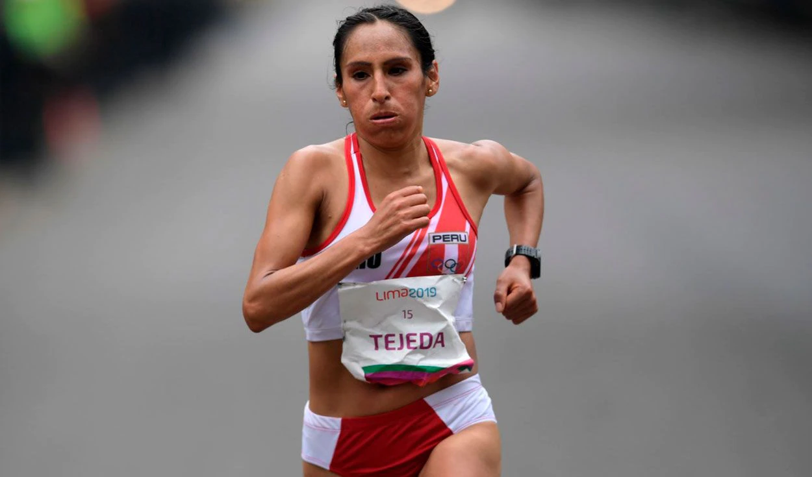
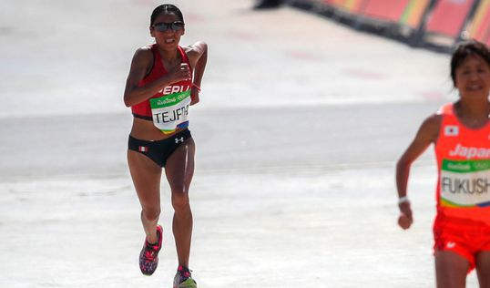

Este artículo es una versión recortada y adaptada de un artículo [publicado originalmente por La República](https://larepublica.pe/deportes/2021/08/05/gladys-tejeda-como-le-ha-ido-en-los-anteriores-juegos-olimpicos-a-la-atleta-peruana-atmp/).

# Gladys Tejeda: el historial de la maratonista peruana en anteriores Juegos Olímpicos

**Deportes LR**

Revisa cómo se ubicó nuestra compatriota en sus otras participaciones. Los Juegos Olímpicos de Tokio 2020 serán los terceros en la carrera de Gladys Tejeda.

Gladys Tejeda, la atleta peruana, es una de las grandes esperanzas nacionales de medalla en los Juegos Olímpicos de Tokio 2020. En su tercera participación en JJ. OO., la campeona de la maratón en los Panamericanos de Lima 2019 enfrentará en las calles de Sapporo a las mejores del mundo en esta modalidad, con el objetivo de darle una alegría más al Perú.

La fondista huancaína entrena a doble turno en dicha ciudad japonesa junto con Jovana de la Cruz, la otra competidora peruana en la carrera de 42,195 kilómetros. “Estuve un mes y medio entrenando en Kenia, lo que ha sido una experiencia muy buena. Estoy muy motivada para lo que puede pasar aquí en Tokio, donde espero aplicar toda la experiencia que he ganado en estos años en el atletismo. Siento que vamos a dar la pelea”, afirmó Tejeda tras su llegada a Japón.

## ¿Cómo le ha ido a Gladys Tejeda en los anteriores Juegos Olímpicos?

- Los Juegos Olímpicos de Londres 2012 fueron los primeros en los que compitió Gladys Tejeda. En aquella ocasión, la maratonista peruana terminó en la posición 43, con un tiempo de 2.32.07.
- Cuatro años más tarde, en los JJ. OO. de Río 2016, la huancaína superó notablemente la performance anterior: llegó en el puesto 15, con una marca de 2 horas, 29 minutos y 55 segundos, lo cual la convirtió en la latinoamericana mejor ubicada de dicha competición.

## ¿Cuándo corre Gladys Tejeda?

Gladys Tejeda competirá en la maratón femenina de los JJ. OO. Tokio 2020, que se realizará en la ciudad de Sapporo, este viernes 6 de agosto (sábado 7 en Japón), a partir de las siguientes horas, según el país donde te encuentres:

- Perú: 5.00 p. m.
- Japón: 7.00 a. m. (sábado 7 de agosto)
- México: 5.00 p. m.
- Colombia: 5.00 p. m.
- Ecuador: 5.00 p. m.
- Estados Unidos: 6.00 p. m. (ET) / 3.00 p. m. (PT)
- Venezuela: 6.00 p. m.
- Bolivia: 6.00 p. m.
- Paraguay: 6.00 p. m.
- Chile: 6.00 p. m.
- Argentina: 7.00 p. m.
- Uruguay: 7.00 p. m.
- España: 12.00 a.m. (sábado 7 de agosto).
