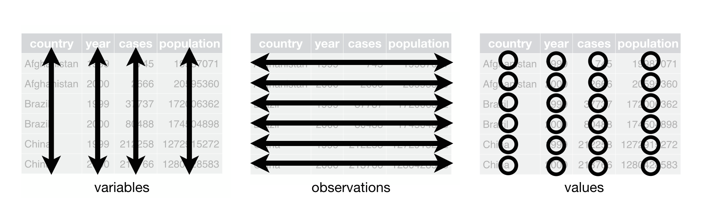

```{r setup, include=FALSE}
knitr::opts_chunk$set(
	echo = TRUE,
	message = FALSE,
	warning = FALSE
)
```

## Requisitos

- Data:
    - "Licenciamiento institucional_5.xlsx"
    - "tabla1.csv"
    - "tabla2.csv"
    - "tabla3.csv"
    - "tabla4a.csv"
    - "tabla4b.csv"
    - "sida_mujeres_peru.csv"
    - "fallecidos_covid.csv"
    
```{r, echo=FALSE}
downloadthis::download_dir(
  "data",
  output_name = "data",
  button_label = "Descargar data",
  button_type = "success",
  has_icon = TRUE,
  icon = "fa fa-save"
)
```

    
```{r, echo=FALSE}
library(tidyverse)
tabla1 <- read_csv("data/tabla1.csv")
tabla2 <- read_csv("data/tabla2.csv")
tabla3 <- read_csv("data/tabla3.csv")
tabla4a <- read_csv("data/tabla4a.csv")
tabla4b <- read_csv("data/tabla4b.csv")
fallecidos_covid <- read_csv("data/fallecidos_covid.csv")
```

## Objetivo de la sesión

En esta sesión aprenderás una manera consistente para organizar tus datos en R a la que llamaremos tidy data (datos ordenados). 

Llevar tus datos a este formato requiere algo de trabajo previo; sin embargo, dicho trabajo tiene ventajas en el largo plazo. Una vez que tengas tus datos ordenados y las herramientas para ordenar datos que provee el *tidyverse*, vas a gastar mucho menos tiempo pasando de una forma de representar datos a otra, lo que te permitirá destinar más tiempo a las preguntas analíticas.

---

Esta sesión trabaja con el contenido del capítulo 12 (*Tidy data*) del libro [R for data science](https://r4ds.had.co.nz/tidy-data.html) y su [traducción](https://r4ds-en-espaniol.netlify.app/datos-ordenados.html) al castellano. 

# Repaso de importación de datos

## Actividades

1. Crear un nuevo proyecto en nuevo directorio: "04-ejercicios"
2. Crear un nuevo archivo R Markdown:
    - Documento HTML
    - Título: "Repaso de importación"
    - Contenido: Resolver las preguntas
3. Enviar el enlace en Rpubs.com del ejercicio resuelto.

## Escenario

Cierta agencia de financiamiento está interesada en invertir en el sector educativo peruano, específicamente, en el sector universitario. Ingresaron a la [Plataforma Nacional de Datos Abiertos](https://www.datosabiertos.gob.pe/) y encontraron el set de datos [**"Licenciamiento Institucional_5.xls"**](https://www.datosabiertos.gob.pe/dataset/sunedu-estado-licenciamiento-universidades) elaborado por SUNEDU. 

Te encargan elaborar un pequeño reporte que les resuelva dudas muy puntuales. Además de las respuestas, la agencia está interesada en conocer el código que usaste para obtener los resultados.

---

Debes responder las siguientes preguntas:

1. ¿Cuántas universidades públicas y privadas existían en el país cuando se inició el proceso de licenciamiento institucional de universidades peruanas?
2. ¿Cuántas universidades públicas obtuvieron el licenciamiento?
3. ¿Cuántas universidades privadas obtuvieron el licenciamiento?

Las respuestas deben ser redactadas en uno o varios párrafos de texto.  Puedes hacer uso de la función `filter()` del paquete `dplyr` para hallar las respuestas más fácil.

# Tidy data (datos ordenados)

---

> “Todas las familias felices se parecen unas a otras, pero cada familia infeliz lo es a su manera.” –– León Tolstoy

> “Todos los set de datos ordenados se parecen unos a otros, pero cada set de datos desordenado lo es a su manera” — Hadley Wickham

---

Esta sesión te dará una introducción práctica a los datos ordenados (o tidy data) y a las herramientas que provee el paquete tidyr. Si deseas aprender más acerca de la teoría subyacente, puede que te guste el artículo Tidy Data publicado en la revista Journal of Statistical Software. 

Descarga: <http://www.jstatsoft.org/v59/i10/paper>

---

Puedes representar los mismos datos subyacentes de múltiples formas. El ejemplo a continuación muestra los mismos datos organizados de cuatro maneras distintas. Cada set de datos muestra los mismos valores de cuatro variables *country, year, cases, population*, pero cada uno organiza los valores de forma distinta.

---

```{r, echo=TRUE}
tabla1
```

---

```{r, echo=TRUE}
tabla2
```

---

```{r, echo=TRUE}
tabla3
```

---

```{r, echo=TRUE}
tabla4a
```

```{r, echo=TRUE}
tabla4b
```

---

Las anteriores son representaciones de los mismos datos subyacentes, pero no todas son igualmente fáciles de usar. Un tipo de conjunto de datos, el conjunto de datos *tidy* (ordenado) será mucho más fácil de trabajar dentro del *tidyverse*.

## Reglas de *tidy data*

Existen tres reglas interrelacionadas que hacen que un conjunto de datos sea ordenado:

1. Cada variable debe tener su propia columna.
2. Cada observación debe tener su propia fila.
3. Cada valor debe tener su propia celda.

{width=90%}

---

Estas reglas están interrelacionadas ya que es imposible cumplir solo dos de las tres. Esta interrelación lleva a un conjunto práctico de instrucciones más simple aún:

- Coloca cada conjunto de datos en un dataframe.
- Coloca cada variable en una columna.

En este ejemplo, solo la `tabla1` es *tidy*. Es la única representación en que cada columna es una variable.

---

¿Por qué asegurarse de que los datos estén ordenados? Existen dos ventajas principales:

- Existe una ventaja general al elegir una forma consistente de almacenar datos. Si tienes **una estructura de datos consistente**, es más fácil aprender las herramientas que funcionan con ella ya que tienen una uniformidad subyacente.

---

- Existe una ventaja específica al situar las variables en las columnas, ya que permite que la naturaleza vectorizada de R brille. Muchas de las funciones que vienen con R trabajan con vectores de valores. Esto hace que **transformar datos ordenados** se perciba como algo casi natural.

---

`dplyr`, `ggplot2` y el resto de los paquetes del *tidyverse* están diseñados para trabajar con datos ordenados. Aquí hay algunos ejemplos de cómo podrías trabajar con `tabla1`.

```{r, echo=TRUE}
# Calcular tasa por cada 10,000 habitantes
tabla1 %>%
  mutate(tasa = cases / population * 10000)
```

---

```{r, echo=TRUE}
# Calcular casos por año
tabla1 %>%
    group_by(year) %>% 
    summarise(cases = sum(cases)) %>% 
    ungroup()
```

---

```{r, echo=TRUE}
# Visualizar cambios en el tiempo
library(ggplot2)
ggplot(tabla1, aes(year, cases)) +
  geom_line(aes(group = country), colour = "grey50") +
  geom_point(aes(colour = country))
```

## Cargar tidyr

Para poder usar las funciones que nos permiten ordenar nuestros datos, necesitamos usar el paquete `tidyr`.

```{r}
library(tidyr)
```

Alternativamente, podemos cargarlo junto al resto de paquetes del `tidyverse`

```{r, eval=FALSE}
library(tidyverse)
```

# Pivotar

---

Los principios sobre datos ordenados parecen tan obvios que te podrías preguntar si alguna vez encontrarás un set de datos que no esté ordenado. Desafortunadamente, **gran parte** de los datos que vas a encontrar están desordenados. Existen dos principales razones para esto:

---

1. La mayoría de las *personas no están familiarizadas* con los principios de datos ordenados y es difícil derivarlos por cuenta propia a menos que pases mucho tiempo trabajando con datos.
2. Los datos a menudo están organizados para facilitar *tareas distintas del análisis*. Por ejemplo, los datos se organizan para que su registro sea lo más sencillo posible.

Esto significa que para la mayoría de los análisis necesitarás hacer algún tipo de orden. El primer paso es entender siempre cuáles son las variables y las observaciones. ¿Qué es lo que está midiendo el set de datos? Esto a veces es fácil; otras veces deberás consultar con quienes crearon el set de datos. 

---

El segundo paso es resolver uno de los siguientes problemas frecuentes:

1. Una variable se extiende por varias columnas
2. Una observación está dispersa entre múltiples filas.

Típicamente, un set de datos tiene *uno* de estos problemas. Si contiene ambos ¡significa que tienes muy mala suerte! 

---

Para solucionar estos problemas necesitarás las dos funciones más importantes de `tidyr`: 

- `pivot_longer()` (pivotar a lo largo),  y 
- `pivot_wider()` (pivotar a lo ancho). 

## Datos "largos"

Un problema común es cuando en un dataset los nombres de las columnas no representan nombres de variables, sino que representan los valores de una variable. Tomando el caso de la `tabla4a`: los nombres de las columnas `1999` y `2000` representan los valores de la variable `year`, los valores en las columnas `1999` y `2000` representan valores de la variable `cases` y cada fila representa dos observaciones en lugar de una.

---

```{r, echo=TRUE}
tabla4a
```

---

Para ordenar un dataset como este necesitamos pivotar las columnas que no se ajustan, en un nuevo par de variables. Para describir dicha operación necesitamos tres parámetros:

- El conjunto de columnas cuyos nombres son valores y no variables. En este ejemplo son las columnas 1999 y 2000.
- El nombre de la variable al que moveremos los nombres de las columnas. En este caso es `year`
- El nombre de la variable al que moveremos los valores de las columnas. En este caso `cases`

---

Con estos parámetros podemos utilizar la función `pivot_longer()` (pivotar a lo largo):

```{r, echo=TRUE}
table4a %>% 
  pivot_longer(c(`1999`, `2000`), names_to = "year", values_to = "cases")
```

---

Las columnas a pivotar quedan seleccionadas siguiendo el estilo de notación de `dplyr::select()`. En este caso hay solo dos columnas, por lo que las listamos individualmente. Ten en consideración que “1999” y “2000” son nombres no-sintáxicos (debido a que no comienzan con una letra) por lo que los rodeamos con acentos graves (o *backticks*). 

Las variables "year" y "cases" no existen todavía en la `tabla4a`, por lo que tenemos que poner sus nombres entre comillas.

{width=90%}


---

En el resultado final, las columnas pivotadas se eliminan y obtenemos la nuevas columnas `year` y `cases`. La relación entre las variables originales se mantiene, tal como se puede observar en la imagen anterior. 

Podemos usar `pivot_longer()` para ordenar `tabla4b` de modo similar. La única diferencia es la variable almacenada en los valores de las celdas. 

---


```{r, echo=TRUE}
table4b %>% 
  pivot_longer(c(`1999`, `2000`), names_to = "year", values_to = "population")
```

---

Para combinar las versiones ordenadas de `tabla4a` y `tabla4b` en un único *tibble*, necesitamos usar `dplyr::left_join()`, función necesaria para trabajar con *datos relacionales*.

```{r, echo=TRUE}
tidy4a <- table4a %>% 
  pivot_longer(c(`1999`, `2000`), names_to = "year", values_to = "cases")
tidy4b <- table4b %>% 
  pivot_longer(c(`1999`, `2000`), names_to = "year", values_to = "population")

left_join(tidy4a, tidy4b)
```

## Datos "anchos"

`pivot_wider()` (pivotar a lo ancho) es lo opuesto de `pivot_longer()`. Se usa cuando una observación aparece en múltiples filas. Por ejemplo, considera la `tabla2`: una observación es un país en un año, pero cada observación aparece en dos filas.

---

```{r, echo=TRUE}
tabla2
```

---

Para ordenar esto, primero analizamos la representación de un modo similar a cómo se haría con `pivot_longer()`. Esta vez, sin embargo, necesitamos únicamente dos parámetros:

- La columna desde la que obtener los nombres de las variables. En este caso corresponde a `type`.
- La columna desde la que obtener los valores. En este caso corresponde a `count`.

---

Una vez resuelto esto, podemos usar `pivot_wider(),` como se muestra debajo.

```{r, echo=TRUE}
table2 %>%
    pivot_wider(names_from = type, values_from = count)
```

---

Veámoslo gráficamente:

```{r, echo=TRUE, eval=FALSE}
table2 %>%
    pivot_wider(names_from = type, values_from = count)
```

{width=90%}

---

Como te habrás dado cuenta a partir de sus nombres, las funciones `pivot_longer()` y `pivot_wider()` son complementarias. `pivot_longer()` genera tablas angostas y largas, `pivot_wider()` genera tablas anchas y cortas.

---

## Separar y unir

Hasta ahora has aprendido a ordenar las tablas `tabla2` y `tabla4`, pero no la `tabla3`, que tiene un problema diferente: tenemos una columna (`rate`) que contiene dos variables (casos y población). 

Para solucionar este problema, necesitamos la función `separate()` (separar). También aprenderás acerca del complemento de `separate()`: `unite()` (unir), que se usa cuando una única variable se reparte en varias columnas.

## Separar

`separate()` desarma una columna en varias columnas, dividiendo de acuerdo a la posición de un carácter separador. Tomemos la `tabla3`:

```{r, echo=TRUE}
tabla3
```

---

La columna `rate` contiene tanto los casos como la población, por lo que necesitamos dividirla en dos variables. La función `separate() `toma el nombre de la columna a separar y el nombre de las columnas a donde irá el resultado, tal como se muestra en el código a continuación.

```{r, echo=TRUE}
table3 %>% 
  separate(rate, into = c("cases", "population"))
```

---

Podemos representarlo así:

{width=90%}

---

Por defecto, `separate()` dividirá una columna donde encuentre un carácter no alfanumérico (esto es, un carácter que no es un número o letra). Por ejemplo, en el siguiente código, `separate()` divide los valores de `rate` donde aparece una barra (/). Si deseas usar un carácter específico para separar una columna, puedes especificarlo en el argumento `sep` de `separate()`. 

---

Por ejemplo, el código anterior se puede re-escribir del siguiente modo:

```{r, echo=TRUE}
table3 %>% 
  separate(rate, into = c("cases", "population"), sep = "/")
```

---

Mira atentamente los tipos de columna: notarás que `cases` y `population` son columnas de tipo carácter. Este es el comportamiento por defecto en `separate()`: preserva el tipo de columna. Aquí, sin embargo, no es muy útil, ya que se trata de números. Podemos pedir a `separate()` que intente convertir a un tipo más adecuado usando `convert = TRUE`:

---

```{r, echo=TRUE}
table3 %>% 
  separate(rate, into = c("cases", "population"), convert = TRUE)
```

## Unir

`unite()` es el inverso de `separate()`: combina múltiples columnas en una única columna. Necesitarás esta función con mucha menos frecuencia que `separate()`, pero aún así es una buena herramienta para conocer.

Podemos usar `unite()` para volver a unir las columnas que acabamos de separar.

---

Usamos `col = rate` para indicar que la nueva columna debe llamarse `rate`. 

```{r, echo=TRUE}
tabla1 %>% 
  unite(col = rate, cases, population, sep = "/")
```

# Ejercicios

---

Usando el set de datos "sida_mujeres_peru.csv":

- Convertir el dataset a un formato *tidy*

Usando el set de datos "fallecidos_covid.csv"

- Obtener el recuento de fallecidos que nacieron en 1960.

El trabajo debe hacerse en un nuevo proyecto: "ejercicios-tidy". Pueden estar incluidos en el mismo documento R Markdown.

# Unir conjuntos de datos

---

Existirán ocasiones en que nuestros datos no vengan todos en un solo archivo. Para ello, es necesario aprender tres maneras en que típicamente vamos a necesitar unirlos o combinarlos.

## Por filas

Veamos el caso de estos dos df. Contienen información de todos los países de un continente en gapminder.

```{r}
gapminder_africa <- read_csv("data/gapminder_africa.csv")
gapminder_asia <- read_csv("data/gapminder_asia.csv")
```

---

```{r}
gapminder_africa
```

---

```{r}
gapminder_asia
```

---

En este caso, podemos juntar información de ambos continentes usando `bind_rows()`, donde cada df a combinar pasa a ser un argumento de la función.

```{r}
bind_rows(gapminder_africa, gapminder_asia)
```

---

También se puede usar pipes.

```{r}
gapminder_africa %>% 
    bind_rows(gapminder_asia)
```

## Ejercicio

Une todos los gapminder continentales en un solo gapminder

## Por  columnas

Puede darse el caso de que nuestra información tiene las columnas divididas en distintos archivos.

```{r, echo=FALSE}
gapminder <- readxl::read_xlsx("data/gapminder.xlsx")
```


```{r}
gapminder_parte1 <- gapminder %>% 
    select(country, continent, year)

gapminder_parte2 <- gapminder %>% 
    select(lifeExp, pop, gdpPercap)
```

---

```{r}
gapminder_parte1
```

---

```{r}
gapminder_parte2
```

---

En este caso, en lugar de unir los df por filas, las unimos por columnas usando `bind_cols()`

```{r}
bind_cols(gapminder_parte1, gapminder_parte2)
```

---

Nuevamente, se puede usar pipes.

```{r}
gapminder_parte1 %>% 
    bind_cols(gapminder_parte2)
```

---

Sin embargo, debes tener cuidado al usar `bind_cols()`, ya que unirá las columnas sin importar si el orden en una de las tablas corresponde al mismo orden de la otra.

Existe una mejor manera de combinar tablas por columnas, haciendo uso de datos relacionales.

## Datos relacionales

Imagina que sólo tuviéramos una tabla con la información que corresponde a los 142 países y su continente. La tenemos ordenada por orden alfabético de continente y país.

```{r}
(gapminder_paises <- read_csv("data/gapminder_paises.csv"))
```

---

Sin embargo, en otra tabla tenemos información de expectativa de vida de los países para todos los años que cubre `gapminder`. Nota que además esta información está ordenada según expectativa de vida de manera descendente.

```{r}
(gapminder_life <- read_csv("data/gapminder_life.csv"))
```

---

Si quisiéramos obtener el continente de cada uno de los países presente en `gapminder_life`, sabemos que podemos deducirla del nombre del país guiándonos del contenido de `gapminder_paises`. La función `left_join()` nos puede ayudar a realizarlo.

---

```{r message=TRUE, warning=TRUE}
(gapminder_life_paises <- left_join(gapminder_life, gapminder_paises))
```

---

Vemos que la información de continente para cada uno de los países se ha repetido para cada año. El trabajo de `left_join()` es repetir en el conjunto de datos primario (el de la izquierda) todos los valores presentes en el set de datos secundario (el de la derecha) para cada variable en común. Es por eso que para cada país fue asignado el continente correspondiente.

Ahora esta tabla ya permite hacer un análisis por continente.

## El argumento `by`

Cuando las variables tienen nombres en común, `left_join()` usa por defecto todos los nombres de variable en común entre ambas tablas. Como en el ejemplo anterior el único nombre en común era `country`, fue la única columna usada.

Ese no es el caso para todos los set de datos

---

`gapminder_pop` tiene en común con `gapminder_life_paises` los nombres de variable *country, year* y *lifeExp*, sin embargo esta última variable tiene `NA` en todas sus observaciones.

```{r}
(gapminder_pop <- read_csv("data/gapminder_pop.csv"))
```

---

Si dejásemos que `left_join()` determinara por defecto las columnas a usar en el cruce de datos, se nos presentaría un problema.

```{r message=TRUE, warning=TRUE}
left_join(gapminder_life_paises, gapminder_pop)
```

---

A pesar de que los nombres de variables son iguales, las observaciones de esas variables no son las mismas para cada tabla, debido a ello el cruce no permite obtener los valores adecuados para *pop*. Felizmente, podemos especificar que se utilicen sólo las variables que sí tienen todos los valores en común entre ambas tablas: *country* y *year*. 

Para ello usamos el argumento `by`.

---

```{r}
( gapminder_life_pop <- left_join(gapminder_life_paises, gapminder_pop, 
                                by = c("country", "year")) )
```

---

En este caso, sí pudimos obtener la información de *pop* correspondiente a cada año y país.

## Unir por variable con nombres distintos

Puede ser que a pesar de que tengamos la misma información, la variable se llame distinto en la siguiente tabla. Por ejemplo, en `gapminder_gdp` la variable *country* se llama *pais*.

```{r}
( gapminder_gdp <- read_csv("data/gapminder_gdp.csv") )
```

---

Si quisiéramos unir esta información con `gapminder_life_pop`, sólo *year* sería reconocida como *llave* por defecto. Toda la información de *gapminder* gdp se repetiría para cada año presente.

```{r}
left_join(gapminder_life_pop, gapminder_gdp)
```

---

Tampoco podemos indicarle el nombre de la variable *country* o *pais*, porque no existe al mismo tiempo en ambos conjuntos de datos.

```{r, error=TRUE}
left_join(gapminder_life_pop, gapminder_gdp, by = c("country", "year"))
```

```{r, error=TRUE}
left_join(gapminder_life_pop, gapminder_gdp, by = c("pais", "year"))
```

---

Necesitamos especificar que la variable de la izquierda equivale con un nombre distinto de la derecha. Seguimos usando el argumento `by`.

```{r}
left_join(gapminder_life_pop, gapminder_gdp, by = c("country" = "pais", "year"))
```


## Con pipes

Uniendo todo en un solo procedimiento.

```{r}
analisis1 <- gapminder_life %>% 
    left_join(gapminder_paises) %>% 
    left_join(gapminder_pop, by = c("country", "year")) %>% 
    select(-lifeExp.y) %>% 
    left_join(gapminder_gdp, by = c("country" = "pais", "year")) %>% 
    group_by(continent, year) %>% 
    summarise(promedio_pbi = mean(gdpPercap))
```

---

```{r}
analisis1
```

---

```{r}
ggplot(analisis1, aes(year, promedio_pbi, color = continent)) +
    geom_line()
```


## Recapitulación

```{r}
(tabla_izquierda <- tibble(a = c(1, 2, 3, 4), 
                          b = c("a", "b", "c", "d"),
                          c = c("uno", "dos", "tres", "cuatro")))
```

---

```{r}
(tabla_derecha1 <- tibble(a = c(1, 2, 3, 3),
                         d = c("hola", "buenos", "dias", "amigo")))
```

---

```{r}
(tabla_derecha2 <- tibble(a = c(2, 3, 4, 5),
                         b = c("w", "x", "y", "z"),
                         d = c("b", "c", "d", "e")))
```

---

```{r}
left_join(tabla_izquierda, tabla_derecha1)
```

---

```{r}
left_join(tabla_izquierda, tabla_derecha2)
```

---

```{r}
left_join(tabla_izquierda, tabla_derecha2, by = "a")
```

---

```{r}
left_join(tabla_izquierda, tabla_derecha2, by = c("a", "b" = "d"))
```


## Retroalimentación

Gracias por tu participación en la sesión de hoy. Para terminar, llena la encuesta de retroalimentación.

<https://bit.ly/Retro-Taller-I>


