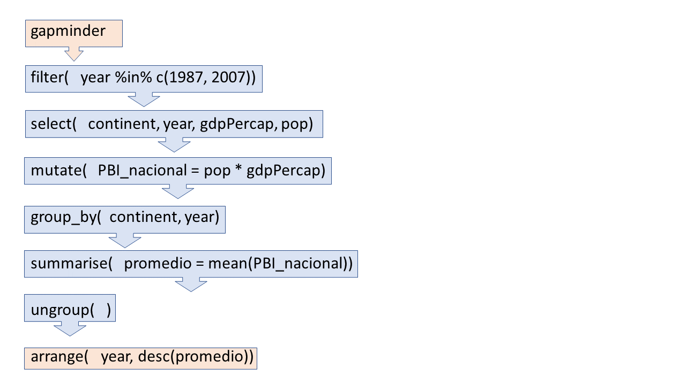

```{r setup, include=FALSE}
knitr::opts_chunk$set(echo = TRUE)
```

## Requisitos de la sesión

- Paquetes:
    - `dplyr` o `tidyverse`
    - `gapminder`

## Crear nuevo proyecto

Crea un nuevo proyecto llamado: 06-ejercicios

Crea un nuevo documento R Markdown en el que vas a tomar nota e ir resolviendo los ejercicios.

## Cargar paquetes {.smaller}

Carguemos los paquetes que necesitaremos en esta sesión.

```{r}
library(tidyverse)
library(gapminder)
```

# Transformación de datos II

---

Hasta el momento hemos aprendido a:

- **Renombrar** variables usando `rename()`
- **Reubicar** variables usando `relocate()`
- **Seleccionar** variables por su nombre con `select()`.
- **Filtrar** observaciones que cumplen alguna condición con `filter()`.
- **Organizar** las filas de acuerdo a sus valores con `arrange()`.

---

En esta sesión aprenderás a:

- **Modificar** las variables de nuestro conjunto de datos con `mutate()`.
- **Resumir** nuestros datos en valores representativos con `summarise()`.
- **Agrupar** nuestros datos para operar en ellos con `group_by()`.

Adicionalmente, aprenderás a usar el operador pipe (`%>%`), que permite combinar todas las operaciones en un solo flujo.

## gapminder_subset {.smaller}

Para entender lo que sucede con estas funciones, crearemos el conjunto `gapminder_subset`. Obtenemos observaciones para cuatro países en dos años observados.

```{r}
gapminder_subset <- filter(gapminder, 
       country %in% c("Peru", "Mexico", "United Kingdom", "France"), 
       year >= 2002)
```

```{r}
gapminder_subset
```

## `mutate()`

Esta función se usa para modificar las variables de nuestro conjunto de datos, ya sea para transformar una variable existente o para crear una nueva. Debemos identificar dos cosas:

1. El nombre del conjunto de datos
2. El nombre de la variable objetivo y la operación necesaria para crearla y modificarla.

```{r, eval=FALSE}
mutate(data, var_objetivo = operacion(var_existente))
```

La operación debe hacerse en una variable existente. Si la variable objetivo ya existe en el conjunto de datos, la será sobreescrita.

## Nueva variable {.smaller}

En `gapminder_subset` contamos con información del PBI per cápita y población. Multiplicando ambas podemos tener el PBI total de un país para determinado año.

```{r}
mutate(gapminder_subset, pbi_total = pop * gdpPercap)
```

Hemos logrado calcular una nueva variable en base a otras ya existentes.

Ya que la población es un número bastante grande, R nos muestra el *tibble* en notación científica (1.73e12 significa que el punto decimal ha sido "adelantado" 12 cifras).

## Constantes {.smaller}

Ten en cuenta que si la operación retorna un solo valor, este será repetido en todas las filas de esa variable.

```{r}
mutate(gapminder_subset, maxima_pob = max(pop))
```

## Recategorización dicotómica {.smaller}

Cuando queremos recategorizar una variable de manera dicotómica, podemos usar la función `if_else()`. Sirve para testear una condición, que de ser verdadera asume el primer valor, y en caso contrario el segundo.

Por ejemplo, para traducir el nombre de nuestros continentes.

```{r}
mutate(gapminder_subset, traduccion = if_else(continent == "Europe", "Europa", "América"))
```

## Recategorización con sobreescritura {.smaller}

Si usamos el mismo nombre que el de una variable existente, nuestra variable será sobreescrita con sus nuevos valores.

```{r}
mutate(gapminder_subset, lifeExp = if_else(lifeExp >= 75, "70 o más", "Menos que 70"))
```

## Recategorización múltiple {.smaller}

En ocasiones, será necesario que la recategorización asuma más de dos posibles valores. En estos casos, usamos la función `case_when()` que permite testear múltiples condiciones. Para abarcar las observaciones que no cumplan ninguna condición, se usa el valor `TRUE`.

```{r}
mutate(gapminder_subset, exp_recat = case_when(lifeExp <= 70 ~ "Menor o igual a 70",
                                               lifeExp <= 75 ~ "Entre 71 y 75",
                                               TRUE ~ "Mayor que 75"))
```

## Recategorización con valores "al vuelo" {.smaller}

Es posible testear condiciones en valores que se calculan "al vuelo". Por ejemplo, recategorizar valores que son mayores que el promedio.

```{r}
mutate(gapminder_subset, mayor_que_promedio = if_else(lifeExp > mean(lifeExp), "Es mayor", "No es mayor"))
```

## `summarise()`

Es una función que nos permite obtener datos resumen de nuestras variables. Algo a tener en cuenta es que al hacer nuestro conjunto de datos sólo retendrá los datos de resumen, obviando la data de la cual fueron obtenidos. Debemos identificar dos cosas:

1. El nombre del conjunto de datos
2. El nombre de la variable resumen objetivo y la operación necesaria para crearla y/o modificarla.

```{r, eval=FALSE}
summarise(data, var_objetivo = operacion(var_existente))
```


## Obtener el recuento

Por ejemplo, podemos obtener el recuento de observaciones de nuestra tabla si usamos `n()`. Esta función nos devuelve la cantidad de observaciones en nuestros  conjunto de datos. En el mismo código podemos asignarle un nombre a la columna, en este caso le ponemos `recuento`.

```{r summarise_n}
summarise(gapminder_subset, recuento = n())
```

## Obtener promedio y mediana {.smaller}

Podemos obtener más de una medida en un solo llamado a `summarise()`. Por ejemplo, podemos obtener el promedio y mediana del PBI per cápita. Además, podemos aprovechar para obtener la diferencia entre ambas medidas dentro del mismo llamado.

```{r}
summarise(gapminder_subset, 
          promedio = mean(gdpPercap), 
          mediana = median(gdpPercap),
          diferencia = promedio - mediana)
```

Esto también es válido en el contexto de `mutate()`.

## `group_by()`

Existe una gran cantidad de datos de resumen que se pueden obtener en nuestro análisis, pero no siempre vamos a querer que los datos sean generales. La función `group_by()` nos permite seleccionar variables para agruparlas y obtener datos de resumen diferenciados. Debemos identificar dos cosas:

1. El nombre del conjunto de datos
2. Las variables de agrupación

Aunque es posible utilizarla en conjunto con otras funciones de `dplyr()`, usarla junto con `summarise()` nos demuestra claramente su poder.

## Recuento agrupado por país {.smaller}

Podemos obtener el recuento de observaciones por país si primero agrupamos nuestros datos. Nótese que uso el mismo nombre de `gapminder_subset` para evitar crear un nuevo objeto en el Environment.

```{r group_by_recuento}
gapminder_subset <- group_by(gapminder_subset, country)
```

```{r}
gapminder_subset
```

En principio, los datos no han sufrido ninguna modificación, pero podemos observar que  ahora además de las filas y columnas, obtenemos los grupos formados.

## {.smaller}

Si calculamos el recuento de observaciones, ahora obtenemos un valor para cada uno de nuestros grupos.

```{r }
summarise(gapminder_subset, recuento = n())
```
Debido a que sólo contábamos con una variable de agrupación, `summarise()` genera un nuevo *tibble* que ya no está agrupado.

## `ungroup()`

Los datos permanecerán agrupados hasta que le indiquemos al df que se debe desagrupar, a través de `ungroup()`. Debemos especificar:

1. El nombre del conjunto de datos

```{r }
gapminder_subset <- ungroup(gapminder_subset)
```

Esto es particularmente útil si posteriormente queremos encadenar otra operación, como `filter()` o `mutate()` en los nuevos valores calculados.

## Calcular promedio y mediana por año {.smaller}

Con la información de `gapminder_subset` es posible calcular el promedio y mediana del PBI per cápita por año. Hacemos esto usando `group_by()` y `summarise`.

```{r}
gapminder_subset <- group_by(gapminder_subset, year)
```

```{r}
summarise(gapminder_subset, promedio = mean(gdpPercap), mediana = median(gdpPercap))
```

```{r}
gapminder_subset <- ungroup(gapminder_subset)
```

## Ejercicio 1


- ¿Cuál fue el promedio mundial de la expectativa de vida en 1952?

```{r, echo=FALSE}
gapminder %>% 
    filter(year == 1952) %>% 
    summarise(promedio_exp_vida = mean(lifeExp))
```


## Ejercicio 2

Usando `gapminder`, responder la siguiente pregunta:

- ¿Cuál fue el promedio del PBI total de los países de Europa en 1987?

```{r, echo=FALSE}
gapminder %>% 
    filter(continent == "Europe", year == 1987) %>% 
    mutate(pbi_total = pop * gdpPercap) %>% 
    summarise(promedio_pbi_total = mean(pbi_total))
```


## Ejercicio 3

Usando `gapminder`, responder la siguiente pregunta:

- ¿Cuál fue el continente con mayor suma de PBI total en 1992?

```{r, echo=FALSE}
gapminder %>% 
    filter(year == 1992) %>%
    mutate(pbi_total = pop * gdpPercap) %>% 
    group_by(continent) %>% 
    summarise(suma_pbi_total = sum(pbi_total)) %>% 
    arrange(desc(suma_pbi_total))
```

## Ejercicio 4 - opcional

Usando `gapminder`, recrea el siguiente gráfico.

```{r echo=FALSE, message=FALSE, warning=FALSE}
gapminder %>% 
    group_by(continent, year) %>% 
    summarise(promedio_exp_vida = mean(lifeExp)) %>% 
    ungroup() %>% 
    ggplot(aes(year, promedio_exp_vida, color = continent)) +
    geom_line()
```

# Descanso de 15 minutos

# Operador pipe

## Primer argumento de las funciones

Es importante notar una característica común entre todas las funciones de `dplyr()` que hemos conocido: el primer argumento siempre es el conjunto de datos al que se le va a aplicar la transformación. Esta es una característica consistente con todos los paquetes del `tidyverse`, que permite tener un flujo de trabajo *pipeable*.

## Ejemplos

```{r, eval=FALSE}
filter(gapminder, country == "Peru")
select(gapminder, continent, year, pop)
arrange(gapminder, desc(gdpPercap))
mutate(gapminder, pbi_total = pop * gdpPercap)
summarise(gapminder, promedio_pbi_pc = mean(gdpPercap))
group_by(gapminder, continent)
ungroup(gapminder)
```

Lo que esto quiere decir concretamente es que las funciones se pueden encadenar a través de un operador llamado *pipe* (`%>%`), cuyo valor en el lado izquierdo se convierte en el primer argumento de la función del lado derecho. 

## {.smaller}

Por ejemplo:

```{r}
filter(gapminder_subset, country == "Peru")
```
Es lo mismo que:

```{r}
gapminder_subset %>% filter(country == "Peru")
```

---

Atajo de teclado para insertar el *pipe*:

- Windows: Ctrl + Shift + M
- Mac: Cmd + Shift + m

Usar esto en una sola función no parece muy útil, así que veamos un ejemplo un poco más extenso.

## Flujo de análisis

En `gapminder` tengo todo lo necesario para obtener el ranking del promedio del PBI nacional para cada uno de los cinco continentes en los años 1987 y 2007 (esto me permitirá comparar los cambios en la economía mundial en esos veinte años).

Para ello voy a requerir usar todas las funciones de `dplyr` que he aprendido hasta el momento. Primero lo haremos paso por paso y luego convertiremos todo en el flujo de unos cuantos *pipes*.

## {.smaller}

Debido a que sólo necesito los años 1987 y 2007, filtro mis datos. Al objeto modificado lo llamaré `gapminder_modificado`.

```{r gapminder_flow1}
gapminder_modificado <- filter(gapminder, year %in% c(1987, 2007))
```

```{r}
gapminder_modificado
```

## {.smaller}

El siguiente paso es quedarme sólo con las variables que necesito. En este caso son continente, año, PBI per cápita y población.

```{r}
gapminder_modificado <- select(gapminder_modificado, continent, year, gdpPercap, pop)
```

```{r}
gapminder_modificado
```

## {.smaller}

A continuación, debo obtener el PBI nacional multiplicando el PBI per cápita por la población.

```{r gapminder_flow3}
gapminder_modificado <- mutate(gapminder_modificado,
                               PBI_nacional = pop * gdpPercap)
```

```{r}
gapminder_modificado
```

## {.smaller}

Ahora que tengo el PBI nacional, puedo obtener el promedio por año y continente.

```{r gapminder_flow4, message=FALSE, warning=FALSE}
gapminder_modificado <- group_by(gapminder_modificado, continent, year)
gapminder_modificado <- summarise(gapminder_modificado, promedio = mean(PBI_nacional))
gapminder_modificado <- ungroup(gapminder_modificado)
```

```{r}
gapminder_modificado
```

## {.smaller}

Ahora sólo me falta ordenar mis datos de manera descendente según el promedio del PBI. 

```{r gapminder_flow5}
gapminder_modificado <- arrange(gapminder_modificado, year, desc(promedio))
```

```{r}
gapminder_modificado
```

## {.smaller}

Listo. Con el flujo de análisis terminado, puedo verificar que en esos veinte años, Asia superó a Europa en el promedio de su PBI nacional.

Podría juntar todos estos pasos en un solo bloque para que quede claro lo que sucedió.

```{r, message=FALSE, warning=FALSE}
gapminder_modificado <- filter(gapminder, year %in% c(1987, 2007)) 
gapminder_modificado <- select(gapminder_modificado, continent, year, gdpPercap, pop)
gapminder_modificado <- mutate(gapminder_modificado, PBI_nacional = pop * gdpPercap)
gapminder_modificado <- group_by(gapminder_modificado, continent, year)
gapminder_modificado <- summarise(gapminder_modificado, promedio = mean(PBI_nacional))
gapminder_modificado <- ungroup(gapminder_modificado)
gapminder_modificado <- arrange(gapminder_modificado, year, desc(promedio))
```

## Reescribiendo el flujo con pipes {.smaller}

Podemos hacer todo el análisis usando pipes.

```{r gapminder_pipeline, message=FALSE, warning=FALSE}
gapminder %>% 
  filter(year %in% c(1987, 2007)) %>%
  select(continent, year, gdpPercap, pop) %>% 
  mutate(PBI_nacional = pop * gdpPercap) %>% 
  group_by(continent, year) %>% 
  summarise(promedio = mean(PBI_nacional)) %>% 
  ungroup() %>% 
  arrange(year, desc(promedio))
```

## {.smaller}

Hemos obtenido el mismo resultado escribiendo mucho menos código y sin crear ningún objeto intermedio. Además, podemos seguir el proceso de análisis *como si fuera una secuencia de pasos*. Piensa el *pipe* como un *luego* en la secuencia.

```{r, eval=FALSE}
gapminder %>% 
  filter(year %in% c(1987, 2007)) %>%
  select(continent, year, gdpPercap, pop) %>% 
  mutate(PBI_nacional = pop * gdpPercap) %>% 
  group_by(continent, year) %>% 
  summarise(promedio = mean(PBI_nacional)) %>% 
  ungroup() %>% 
  arrange(year, desc(promedio))
```

1. Tomo `gapminder`
2. Filtro las observaciones de los años 1987 y 2007
3. Selecciono las variables relevantes
4. Calculo el PBI nacional
5. Agrupo por continente y año
6. Obtengo el promedio del PBI nacional
7. Desagrupo el conjunto de datos
8. Organizo por año y promedio descendente.

---

{width=100%}

## Ejercicio 1

Utilizando `gapminder` y las funciones de `dplyr`, obtén el ranking del PBI nacional de Perú, México, Colombia y Chile en los años 1967, 1987 y 2007. 

Guíate de esta secuencia:

1. Usar gapminder
2. Filtrar los datos de los  cuatro países y los años seleccionados
3. Seleccionar las variables país, población y pbi per cápita
4. Calcular el pbi total para cada observación
5. Agrupar las observaciones por año
6. Organizar por valor de pbi total en orden descendente
7. Desagrupar las observaciones

## Ejercicio 2

Realiza un análisis que permita responder a la pregunta:

¿Qué continentes tuvieron la mejor y peor expectativa de vida *mediana* en 1992?